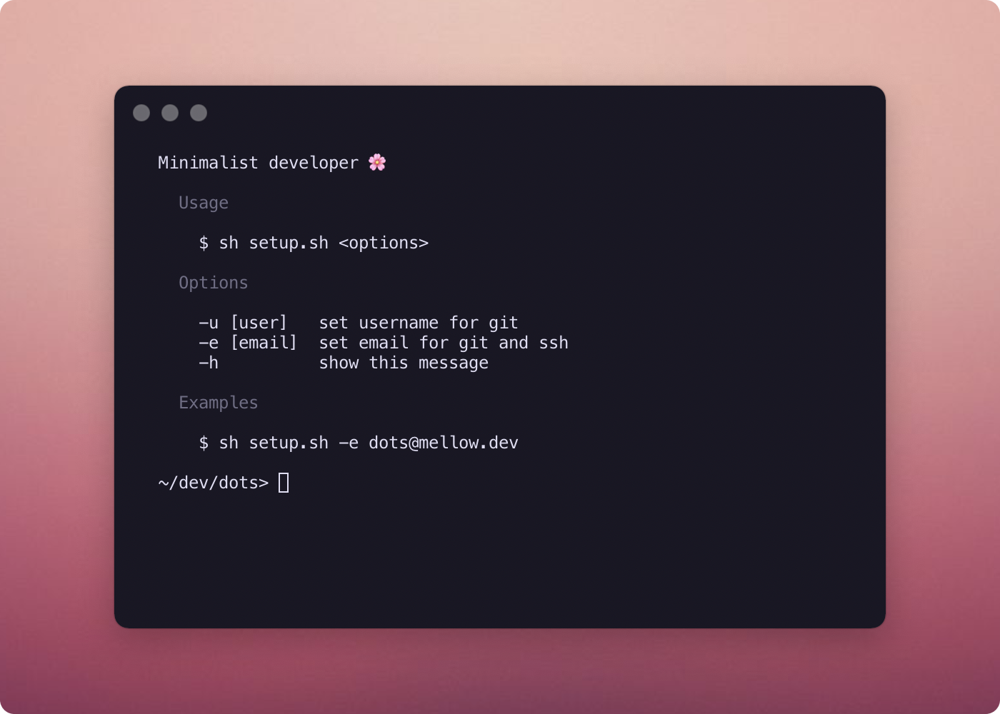

# Minimalist developer

The setup script will install and configure a minimal amount of applications, command line tools, and other packages.

## Getting started

```sh
$ curl -LJO https://raw.githubusercontent.com/mvllow/dots/master/setup.sh && sh ./setup.sh
```

> For global git config/ssh keys see usage below



## Caveats

VSCode needs to be approved via System Preferences on first open. Because of this, extensions may not install properly on the initial run. To fix, open VSCode and run the script again.

Proof of concept for a way of manually extracting a vsix. This allows extensions to be installed before vscode has been opened the first time.

> https://gist.github.com/mvllow/96aabfa338a11c41f11a286985391ade

## Modified files

> Only installed apps will be configured (see [brewfile](https://github.com/mvllow/dots/blob/master/brewfile))

```
.vimrc
.zshrc
.hyper.js
.config
└── nvim
    └── init.vim
Library/Application Support
├── Sublime Text 3
│   ├── Packages/User/Default (OSX).sublime-keymap
│   ├── Packages/User/Package Control.sublime-settings
│   └── Packages/User/Preferences.sublime-settings
├── Code
│   └── User/settings.json
└── Code - Insiders/User
    └── User/settings.json
```

## System preferences

| Setting                                 | Value |
| --------------------------------------- | ----- |
| **Dock**                                |       |
| Autohide                                | true  |
| Show recent apps                        | false |
| Show only active apps                   | true  |
| **Keyboard**                            |       |
| Auto correct                            | false |
| Auto capitilise                         | false |
| Use smart quotes/dashes                 | false |
| Enable system-wide key repeat           | true  |
| Enable faster key repeat                | 2     |
| Enabled shorter delay before key repeat | 10    |
| **Trackpad**                            |       |
| Tap to click                            | true  |
| Increase tracking speed                 | 3     |
| **Finder**                              |       |
| Warn on file extension change           | false |
| Warn on emptying trash                  | false |
| **Menubar**                             |       |
| Show battery percentage                 | true  |

### Manual settings

> Due to the nature of these settings, they must be set by the user

- Preferences > Keyboard > Modifier Keys > Map caps lock to escape
- Preferences > Privacy > Full Disk Access > Allow Terminal.app\*

\* _Needed for zapping brew casks and other priviledged tasks_

## Misc

- SF Mono is copied to Font Book for easier accessibility
- The theme used in most apps is [Rosé Pine](https://github.com/rose-pine/rose-pine-theme)

## Guides

- [Signing git commits with GPG](https://github.com/mvllow/dots/blob/master/guides/signing-git-commits-with-gpg.md)
