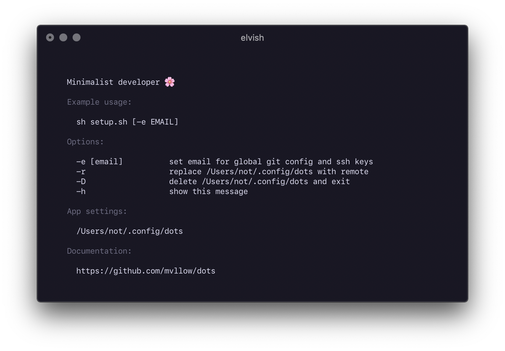

# Minimalist developer

The setup script will install and configure a minimal amount of applications, command line tools, and other packages.

## Getting started

```sh
$ curl -LJO https://raw.githubusercontent.com/mvllow/dots/master/setup.sh && sh ./setup.sh
```

> For global git config/ssh keys see usage below



## Caveats

VSCode needs to be approved via System Preferences on first open. Because of this, extensions may not install properly on the initial run. To fix, open VSCode and run the script again.

Proof of concept for a way of manually extracting a vsix. This allows extensions to be installed before vscode has been opened the first time.

> https://gist.github.com/mvllow/96aabfa338a11c41f11a286985391ade

## App preferences

> Only installed apps will be configured

| App             | Modified files                                                      |
| --------------- | ------------------------------------------------------------------- |
| Zsh             | ~/.zshrc                                                            |
| Vim             | ~/.vimrc                                                            |
| NeoVim          | ~/.vimrc                                                            |
| Hyper           | ~/.hyper.js                                                         |
| VSCode          | ~/Library/Application\ Support/Code/User/settings.json              |
| VSCode Insiders | ~/Library/Application\ Support/Code\ -\ Insiders/User/settings.json |

## System preferences

| Setting                                 | Value |
| --------------------------------------- | ----- |
| **Dock**                                |       |
| Autohide                                | true  |
| Show recent apps                        | false |
| Show only active apps                   | true  |
| **Keyboard**                            |       |
| Auto correct                            | false |
| Auto capitilise                         | false |
| Use smart quotes/dashes                 | false |
| Enable system-wide key repeat           | true  |
| Enable faster key repeat                | 2     |
| Enabled shorter delay before key repeat | 10    |
| **Trackpad**                            |       |
| Tap to click                            | true  |
| Increase tracking speed                 | 3     |
| **Finder**                              |       |
| Warn on file extension change           | false |
| Warn on emptying trash                  | false |
| **Menubar**                             |       |
| Show battery percentage                 | true  |

## Misc

- SF Mono is copied to Font Book for easier accessibility

## Guides

- [Signing git commits with GPG](https://github.com/mvllow/dots/blob/master/guides/signing-git-commits-with-gpg.md)
